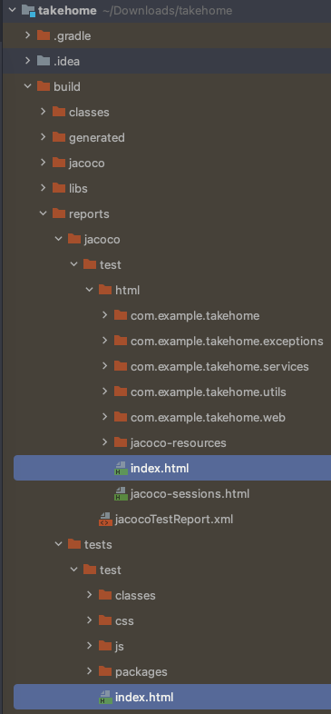
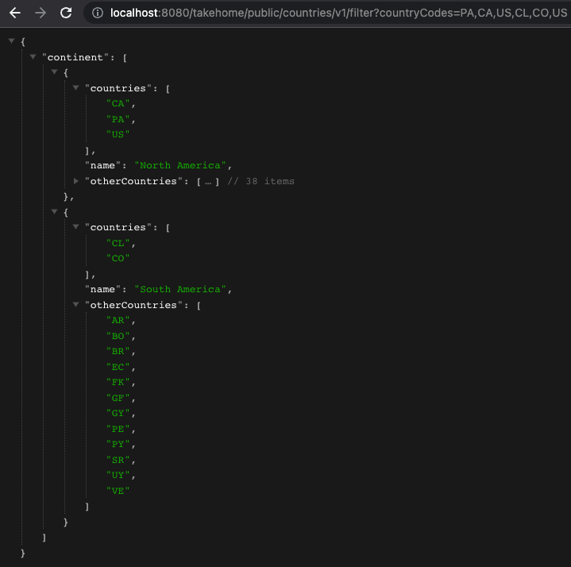
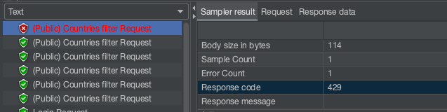
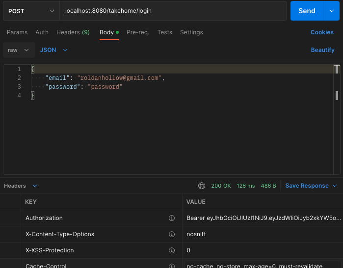
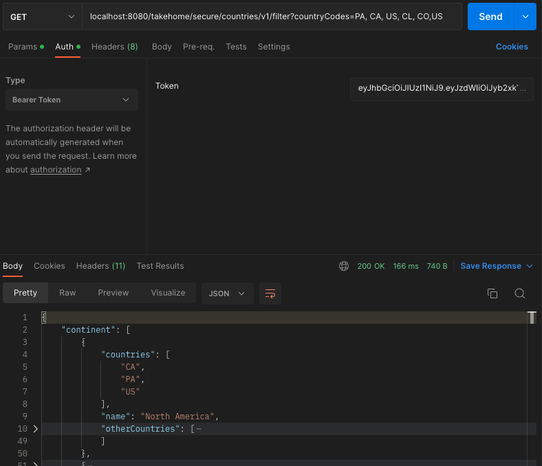
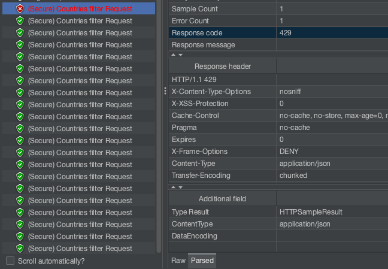
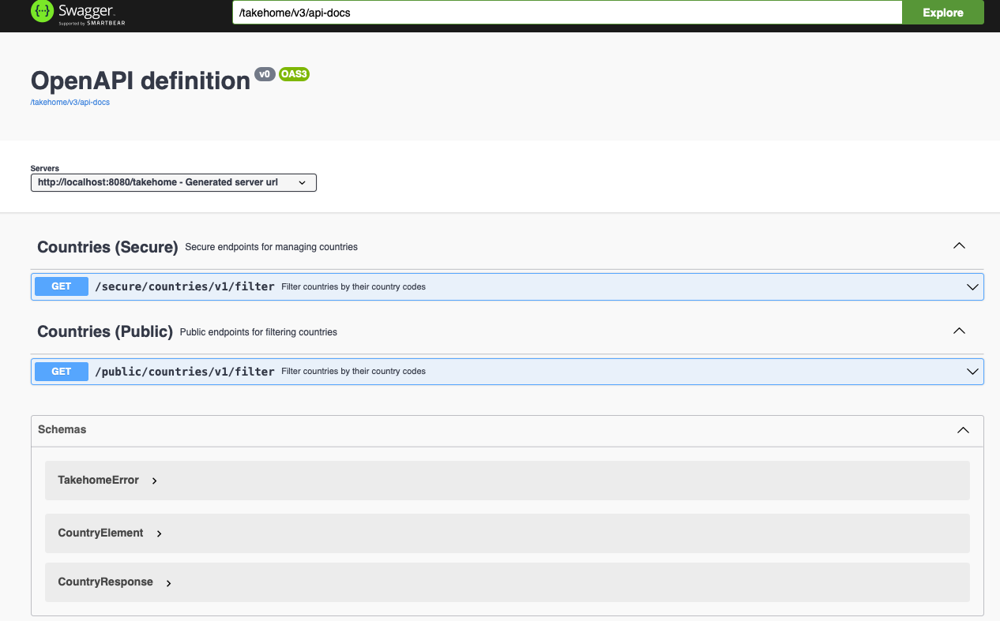

# Takehome
Application that accepts a list of country codes and returns a list of country codes that are in the same continent as the country code input.

> <i>This application is calling [Countries Trevor Blades API](https://countries.trevorblades.com/graphql) in order to get up-to-date data.</i>

# Software Requirements

Project with the latest available versions of the following:

* [Spring Boot 3.0.1](https://spring.io/blog/2022/12/22/spring-boot-3-0-1-available-now)
* Spring Web
* Spring Data JPA
* [Spring Security](https://github.com/spring-projects/spring-security#spring-security)
* JsonWebToken
* [Spring for Graphql](https://spring.io/blog/2022/12/20/spring-for-graphql-1-1-1-released)
* [Bucket4j](https://bucket4j.com/8.1.1/toc.html)
* Java 17 **Check out [SDKMAN!](https://sdkman.io/)**
* Jakarta EE
* H2
* Gradle 7.5+
* Lombok


## Setup for IntelliJ

* Install "lombok" plugin & Enable: Settings -> Compiler -> Annotation Processor -> Enable annotation processing

### How to execute

1. Cleaning build folder:

```shell
./gradlew clean
```

2. Testing, checking coverage and make jar file:

```shell
./gradlew jacocoTestReport
```

> <i>Note: After this step, you can find the reports as following:</i>
> - <i><b>Test report</b>: build/reports/tests/index.html</i>
> - <i><b>Jacoco report</b>: build/reports/jacoco/test/html/index.html</i>
> 
> 

3. Building image by running the <i>[Dockerfile](Dockerfile)</i> file:

```shell
docker build --tag=takehome-api:latest .
```

> <i>Note: Remember download and install [Docker](https://www.docker.com/community-edition) previous running this step </i>

4. Run

```shell
docker run --name takehome-api -p8080:8080 -e nsr=20 -e nur=5 -e secret=u2mjKcteBu99zVJqG1/V4HkzCWbr5Khv takehome-api:latest
```

> <i>Note: Make sure port 8080 port is not in use</i>

- <b>Variables</b>

| Variable | Info                          |
|----------|-------------------------------|
| nsr      | Limit of secure request (20)  |
| nur      | Limit of unsecure request (5) |
| secret   | Secret to generate token      |

### Using application

[Base path](http://localhost:8080/takehome)

#### 1. [Responses structure](Structure_readme.md)

#### 2. Public filter call

[GET] http://localhost:8080/takehome/public/countries/v1/filter?countryCodes=PA,CA,US,CL,CO

- <i>Response</i>



><i>Note: For more than 5 request per seconds, it responses 422 code error</i>



#### 3. Secure call

##### 3.1 Login

For login use the following:

[POST] http://localhost:8080/takehome/login

- <i>Body</i>

```json
  {
    "email": "roldanhollow@gmail.com",
    "password": "password"
  }
```

- <i>Response</i>

> <i>Note #1: Authorization key can be found in the response header.</i>
> <i>(Wrong credentials responses 401)</i>
>
> <i>Please copy it for the next step</i>



><i>Note #2: Takehome users are being loaded by using the [data.sql](src/main/resources/data.sql) file (for H2 db)</i>

##### 3.2 Secure filter

Use the Bearer token as an Authorization

[GET] http://localhost:8080/takehome/secure/countries/v1/filter?countryCodes=PA,CA,US,CL,CO

- <i>Response</i>



><i>Note: For more than 20 request per seconds, it responses 422 code error</i>



### Check details

| URL                                            | Info     |
|------------------------------------------------|----------|
| http://localhost:8080/takehome/swagger-ui.html | Swagger  |
| http://localhost:8080/takehome/actuator        | Actuator |
| http://localhost:8080/takehome/actuator/health | Health   |

> For Swagger remember authenticate using the one mentioned in 2.3.1 Login



## Additional

* Controller (Spring web)
* Filters (Spring Security): UsernamePasswordAuthenticationFilter, OncePerRequestFilter 
* Service (Spring Framework)
* Repository, Entity (Spring Data)
* Validations (Valid, Size - Jakarta EE)
* Exception handler (Spring web)

Any further information please email me to roldanhollow@gmail.com

[If you liked it, please buy me a 🥭 juice ✋🏻😁!](https://paypal.me/Sanidapp)

Enjoy!